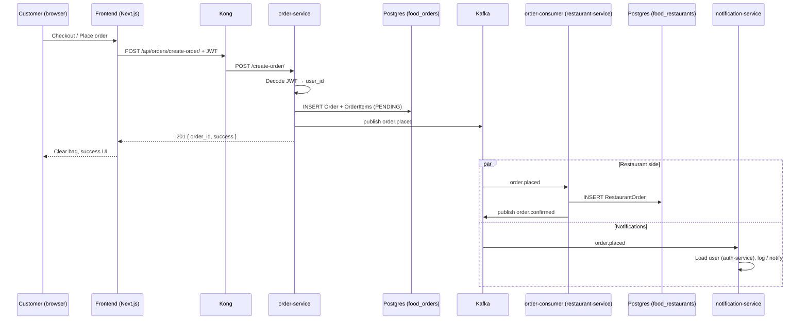

A micro-service based on Choreography-based Saga pattern

## Order creation flow

Placing an order is a **choreography saga**: each service reacts to events on its own—there is no central orchestrator. The happy path today looks like this.

### 1. Browse and build the cart (frontend only)

| Step | What happens |
|------|----------------|
| Menu discovery | The Next.js app loads menus/restaurants via Kong → **restaurant-service** (`GET /api/restaurants/...`). |
| Add to bag | Items are stored in the browser **`localStorage`** (`lib/bag.ts`). No backend call yet. |
| Cart / checkout | `/cart` and `/checkout` read the bag client-side and compute subtotal, tax, and delivery fee. |

The user must be **logged in** (NextAuth + **auth-service** JWT). The access token is attached to API calls from `lib/services/api.ts` (`Authorization: Bearer …`).

### 2. Place order (synchronous HTTP)

```http
POST http://localhost:7000/api/orders/create-order/
Authorization: Bearer <access_token>
Content-Type: application/json

{
  "restaurant_id": 1,
  "total_price": 42.50,
  "items": [{ "menu_id": 3, "quantity": 2 }]
}
```

| Component | Role |
|-----------|------|
| **Kong** (`:7000`) | Routes `/api/orders/*` → **order-service** (`:5002`), strips the gateway prefix. |
| **order-service** | Validates JWT (`user_id` from token), writes **`food_orders`** (`Order` + `OrderItem`, status `PENDING`), then publishes **`order.placed`** to Kafka. |
| **Frontend** | `checkout/page.tsx` → RTK Query `createOrder` → clears bag and shows success toast. |

Response: `{ "order_id": <id>, "success": true }` (HTTP 201).

Customers can list their orders later via:

```http
GET http://localhost:7000/api/orders/my-orders/
Authorization: Bearer <access_token>
```

(shown on **Customer Dashboard** in the frontend).

### 3. Async reactions (Kafka choreography)

After **`order.placed`** is published, independent consumers run in parallel:



| Topic | Producer | Consumer(s) | Effect |
|-------|----------|-------------|--------|
| `order.placed` | order-service | **order-consumer** (restaurant-service), **notification-service** | Restaurant records the order; notification service fetches user details and handles alerts. |
| `order.confirmed` | order-consumer | *(none wired yet)* | Emitted after `RestaurantOrder` is created. |
| `order.updated` | order-service | *(consumers TBD)* | Emitted when a restaurant updates status via `POST /update-order/`. |

The **order-consumer** container runs `python manage.py consume_order_events` (same image as restaurant-service, separate process in `docker-compose.yml`).

### 4. Restaurant status updates (optional path)

A restaurant owner can move a **PENDING** order to **CONFIRMED**, **PREPARING**, or **CANCELED** via:

```http
POST http://localhost:7000/api/orders/update-order/
```

That updates **`food_orders`** and publishes **`order.updated`** (authorization checks restaurant ownership via restaurant-service).

### 5. Payment service (scaffold)

**payment-service** (Go, Gin, GORM, `:5005`, DB `food_payments`) is set up behind Kong at `/api/payments/` but is **not yet part of the checkout saga**. Checkout currently supports COD/card UI only; charging/capture will plug in here later.

### Databases involved

| Database | Service | Order-related data |
|----------|---------|-------------------|
| `food_orders` | order-service | `Order`, `OrderItem` |
| `food_restaurants` | restaurant-service | `RestaurantOrder` (from Kafka) |
| `food_users` | auth-service | User identity for JWT |

### Prerequisites for the saga

- Kafka topic **`order.placed`** must exist (see commands below).
- **`order-consumer`** and **notification-service** must be running.
- Customer JWT must be valid (auth-service access token; NextAuth refreshes it on the frontend).

---

Run docker-compose:

```bash
docker-compose up --build
```

Access kafka-ui

```bash
localhost:8089
```

Access Kong GUI:

```bash
http://localhost:7002
```

Access services via Kong:

```bash
http://localhost:7000/api/auth/
http://localhost:7000/api/restaurants/
http://localhost:7000/api/orders/
http://localhost:7000/api/payments/
http://localhost:7000/api/notifications/
```

Frontend (Next.js): `http://localhost:3000` — checkout at `/checkout`, customer orders at `/dashboard/customer`.

create databases manually:

```bash
docker exec -i <postgres_container_name> psql -U postgres -f /docker-entrypoint-initdb.d/init.sql
```

create kafka topics manually:

```bash
docker exec kafka kafka-topics.sh --create --topic test_topic --bootstrap-server localhost:9092 --partitions 1 --replication-factor 1
```

list kafka topics:

```bash
docker exec kafka kafka-topics.sh --list --bootstrap-server localhost:9092
```

consume kafka topics:

```bash
docker exec -it restaurant-service python manage.py consume_order_events
```

kafka topic list:

```bash
docker exec kafka kafka-topics.sh --list --bootstrap-server localhost:9092
```

create topics:

```bash
docker exec kafka kafka-topics.sh --create --topic order.placed --bootstrap-server localhost:9092 --partitions 3 --replication-factor 1
docker exec kafka kafka-topics.sh --create --topic user.registered --bootstrap-server localhost:9092 --partitions 3 --replication-factor 1
```

delete topic:

```bash
docker exec kafka kafka-topics.sh --delete --topic order.placed --bootstrap-server localhost:9092
```

seed restaurant menu category:
```bash
docker exec -i restaurant-service python manage.py seed_menu_categories
```

create super-user in auth-service:
```bash
docker exec -it auth-service sh
```

then type: 
```bash
python manage.py createsuperuser
```

For elastic dashboard: 
```bash
http://localhost:5601/app/management/kibana/dataViews
```
