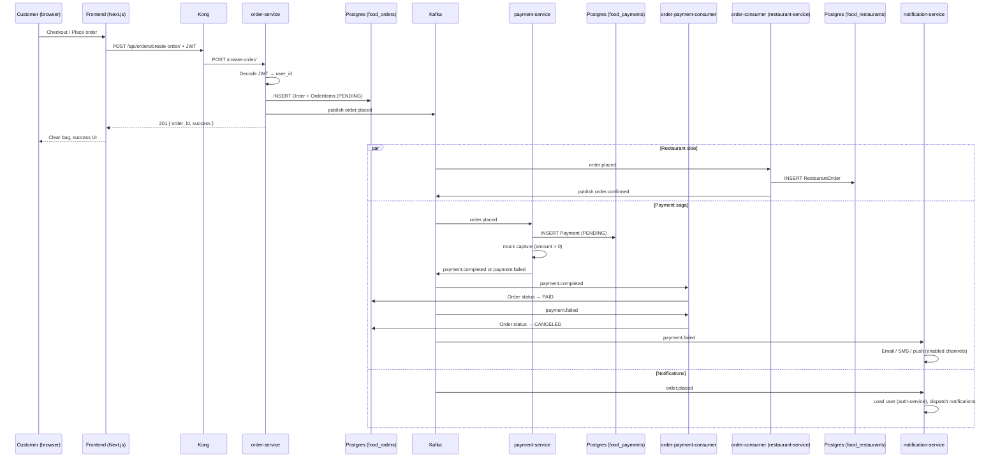

A micro-service based on Choreography-based Saga pattern

## Order creation flow

Placing an order is a **choreography saga**: each service reacts to events on its own—there is no central orchestrator. The happy path today looks like this.

### 1. Browse and build the cart (frontend only)

| Step | What happens |
|------|----------------|
| Menu discovery | The Next.js app loads menus/restaurants via Kong → **restaurant-service** (`GET /api/restaurants/...`). |
| Add to bag | Items are stored in the browser **`localStorage`** (`lib/bag.ts`). No backend call yet. |
| Cart / checkout | `/cart` and `/checkout` read the bag client-side and compute subtotal, tax, and delivery fee. **`/checkout` requires a logged-in customer**; guests are prompted to sign in (redirects back via `callbackUrl=/checkout`). |

The access token is attached to API calls from `lib/services/api.ts` (`Authorization: Bearer …`). Login and register honor `?callbackUrl=` so users return to checkout after signing in.

### 2. Place order (synchronous HTTP)

```http
POST http://localhost:7000/api/orders/create-order/
Authorization: Bearer <access_token>
Content-Type: application/json

{
  "restaurant_id": 1,
  "total_price": 42.50,
  "items": [{ "menu_id": 3, "quantity": 2 }]
}
```

| Component | Role |
|-----------|------|
| **Kong** (`:7000`) | Routes `/api/orders/*` → **order-service** (`:5002`), strips the gateway prefix. |
| **order-service** | Validates JWT (`user_id` from token), writes **`food_orders`** (`Order` + `OrderItem`, status `PENDING`), then publishes **`order.placed`** to Kafka. |
| **Frontend** | `checkout/page.tsx` → RTK Query `createOrder` → clears bag and shows success toast. |

Response: `{ "order_id": <id>, "success": true }` (HTTP 201).

Customers can list their orders later via:

```http
GET http://localhost:7000/api/orders/my-orders/
Authorization: Bearer <access_token>
```

(shown on **Customer Dashboard** in the frontend).

### 3. Async reactions (Kafka choreography)

After **`order.placed`** is published, independent consumers run in parallel:



| Topic | Producer | Consumer(s) | Effect |
|-------|----------|-------------|--------|
| `order.placed` | order-service | **order-consumer**, **payment-service**, **notification-service** | Restaurant copy; payment ledger + capture; order-placed notification. |
| `payment.completed` | payment-service | **order-payment-consumer** | Order status `PENDING` → **`PAID`**. |
| `payment.failed` | payment-service | **order-payment-consumer**, **notification-service** | Order `PENDING` → **`CANCELED`**; customer alert. |
| `order.confirmed` | order-consumer | *(none wired yet)* | Emitted after `RestaurantOrder` is created. |
| `order.updated` | order-service | *(consumers TBD)* | Emitted when a restaurant updates status via `POST /update-order/`. |

Background workers in `docker-compose.yml`:

- **order-consumer** — `python manage.py consume_order_events` (restaurant-service image)
- **order-payment-consumer** — `python manage.py consume_payment_events` (order-service image)
- **payment-service** — HTTP + in-process Kafka consumer for `order.placed`

### 4. Restaurant status updates (optional path)

A restaurant owner can move a **PENDING** order to **CONFIRMED**, **PREPARING**, or **CANCELED** via:

```http
POST http://localhost:7000/api/orders/update-order/
```

That updates **`food_orders`** and publishes **`order.updated`** (authorization checks restaurant ownership via restaurant-service).

### 5. Payment service (Kafka choreography)

**payment-service** (Go, Gin, GORM, slog JSON logs) consumes **`order.placed`**, writes a row to **`food_payments`**, runs a **mock capture** (succeeds when `total_price > 0`), then publishes **`payment.completed`** or **`payment.failed`**.

Health via Kong: `GET http://localhost:7000/api/payments/health`

Payment statuses: `PENDING` → `COMPLETED` | `FAILED`

### 6. Notification service (multi-channel)

**notification-service** (FastAPI) consumes Kafka events and sends notifications through pluggable channels:

| Pattern | Module | Role |
|---------|--------|------|
| Strategy | `notifications/channels/` | `EmailChannel`, `SmsChannel`, `PushChannel` |
| Factory | `notifications/factory.py` | Creates channels by type |
| Facade | `notifications/dispatcher.py` | Dispatches one message to all enabled channels |
| Events | `notifications/events.py` | Templates for `order.placed`, `payment.failed`, `user.registered` |

Configure channels in `notification-service/.env` (copy from `.env.example`):

- **Email** — Mailtrap SMTP (`EMAIL_ENABLED`, `SMTP_*`)
- **SMS** — Twilio (`SMS_ENABLED`, `TWILIO_*`)
- **Push** — FCM (`PUSH_ENABLED`, `FCM_SERVER_KEY`)

### 7. Delivery service (HTTP API)

**delivery-service** (Node/TypeORM) exposes delivery jobs via Kong. Kafka wiring for the order saga is not connected yet.

```http
GET  http://localhost:7000/api/deliveries/active
GET  http://localhost:7000/api/deliveries/:id
POST http://localhost:7000/api/deliveries/
PATCH http://localhost:7000/api/deliveries/:id/status
POST http://localhost:7000/api/deliveries/:id/assign
```

Frontend RTK Query: `frontend/lib/services/delivery-api.ts`

### Databases involved

| Database | Service | Order-related data |
|----------|---------|-------------------|
| `food_orders` | order-service | `Order`, `OrderItem` (statuses include **`PAID`**) |
| `food_payments` | payment-service | `Payment` (linked by `order_id`) |
| `food_restaurants` | restaurant-service | `RestaurantOrder` (from Kafka) |
| `food_users` | auth-service | User identity for JWT |
| `food_deliveries` | delivery-service | `Delivery` (driver assignment, status) |

### Prerequisites for the saga

- Kafka topics **`order.placed`**, **`payment.completed`**, **`payment.failed`** (see commands below).
- **`payment-service`**, **`order-payment-consumer`**, **`order-consumer`**, and **notification-service** must be running.
- Database **`food_payments`** must exist.
- Customer JWT must be valid (auth-service access token; NextAuth refreshes it on the frontend).

---

Run docker-compose:

```bash
docker-compose up --build
```

Access kafka-ui

```bash
localhost:8089
```

Access Kong GUI:

```bash
http://localhost:7002
```

Access services via Kong:

```bash
http://localhost:7000/api/auth/
http://localhost:7000/api/restaurants/
http://localhost:7000/api/orders/
http://localhost:7000/api/payments/
http://localhost:7000/api/notifications/
http://localhost:7000/api/deliveries/
```

Frontend (Next.js): `http://localhost:3000` — checkout at `/checkout`, customer orders at `/dashboard/customer`.

create databases manually:

```bash
docker exec -i <postgres_container_name> psql -U postgres -f /docker-entrypoint-initdb.d/init.sql
```

create kafka topics manually:

```bash
docker exec kafka kafka-topics.sh --create --topic test_topic --bootstrap-server localhost:9092 --partitions 1 --replication-factor 1
```

list kafka topics:

```bash
docker exec kafka kafka-topics.sh --list --bootstrap-server localhost:9092
```

consume kafka topics:

```bash
docker exec -it restaurant-service python manage.py consume_order_events
```

kafka topic list:

```bash
docker exec kafka kafka-topics.sh --list --bootstrap-server localhost:9092
```

create topics:

```bash
docker exec kafka kafka-topics.sh --create --topic order.placed --bootstrap-server localhost:9092 --partitions 3 --replication-factor 1
docker exec kafka kafka-topics.sh --create --topic payment.completed --bootstrap-server localhost:9092 --partitions 3 --replication-factor 1
docker exec kafka kafka-topics.sh --create --topic payment.failed --bootstrap-server localhost:9092 --partitions 3 --replication-factor 1
docker exec kafka kafka-topics.sh --create --topic order.confirmed --bootstrap-server localhost:9092 --partitions 3 --replication-factor 1
docker exec kafka kafka-topics.sh --create --topic user.registered --bootstrap-server localhost:9092 --partitions 3 --replication-factor 1
```

delete topic:

```bash
docker exec kafka kafka-topics.sh --delete --topic order.placed --bootstrap-server localhost:9092
```

seed restaurant menu categories:

```bash
docker exec -i restaurant-service python manage.py seed_menu_categories
```

seed auth users (100 customers, 100 drivers, 50 restaurant owners):

```bash
docker exec -it auth-service python manage.py seed_users
```

Default password: `password123`. Example logins: `customer001@foody.test`, `driver001@foody.test`, `restaurant001@foody.test`.

Optional flags: `--customers`, `--drivers`, `--restaurants`, `--password`, `--domain`. Re-running skips emails that already exist.

create super-user in auth-service:
```bash
docker exec -it auth-service sh
```

then type: 
```bash
python manage.py createsuperuser
```

For elastic dashboard:

```bash
http://localhost:5601/app/management/kibana/dataViews
```

Start notification service only:

```bash
docker-compose up -d --build notification-service
```

Notification service env setup:

```bash
cd notification-service && cp .env.example .env
```
